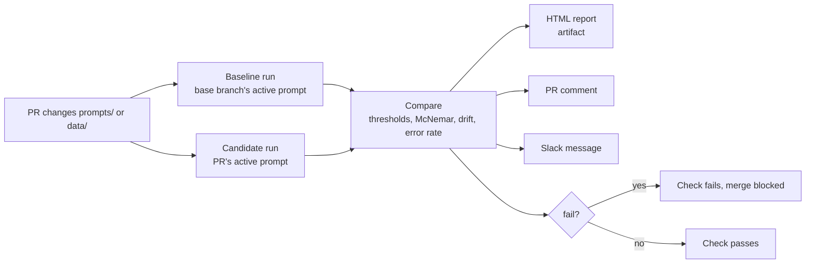
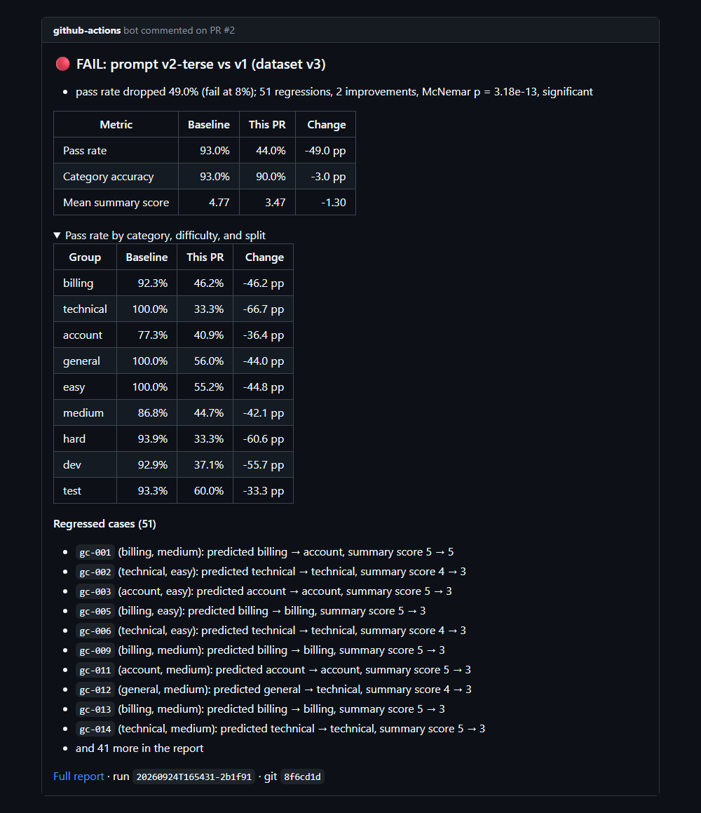
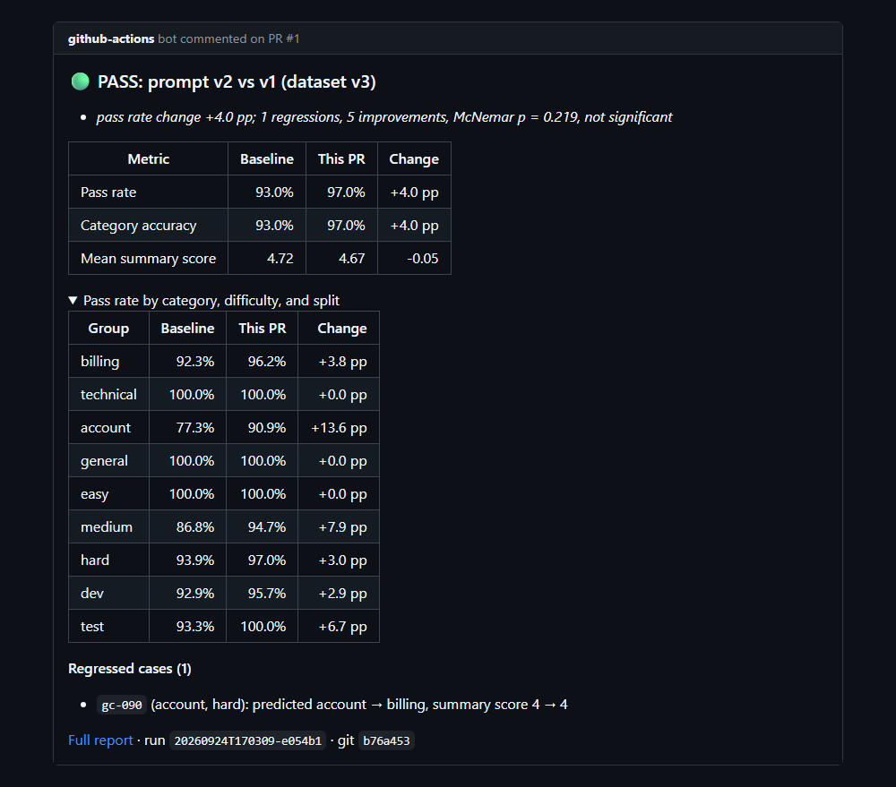
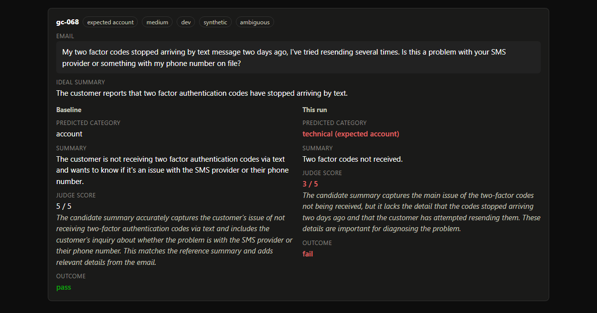

# LLM Regression Detection

A CI gate for an LLM feature. Every pull request that changes a prompt or the golden dataset is evaluated against the production prompt on 100 hand-labeled cases. The result is posted on the PR, and a critical regression blocks the merge.

The feature under test is a deliberately simple customer support email classifier (gpt-4o-mini: one category plus a one-sentence summary). The product is the evaluation machinery around it.



## Proof it works

| Change | Result |
|---|---|
| [PR #2](https://github.com/mohamedchouiki97-pixel/llm-regression-detection/pull/2): a "shorter" prompt with no category definitions and five-word summaries | **FAIL**, pass rate 93% to 44% (-49 pp), 51 regressions, McNemar p = 3e-13. Merge blocked. |
| [PR #1](https://github.com/mohamedchouiki97-pixel/llm-regression-detection/pull/1): prompt v2, built from the labeling guide | First version **passed** overall but lost 7.7 pp on billing, which the report showed case by case. After tightening one rule: 93% to 97% (+4 pp), 5 improvements, 1 regression. Merged. |
| Three identical runs of the same prompt | 0 pass/fail flips. See [docs/judge_noise.md](docs/judge_noise.md). |

<p align="center">
  
  
</p>

The HTML report puts every regressed case side by side: the email, the ideal summary, and the baseline and new outputs with the judge's reasoning.

<p align="center"></p>

It also went wrong in useful ways. Twice, API failures (a rate limit, then an account with no credits) made a run look like a regression. Both incidents changed the design; see [Design decisions](#design-decisions) and [docs/three-signals.md](docs/three-signals.md).

## Quick start

Requires [uv](https://docs.astral.sh/uv/) and an OpenAI API key.

```sh
uv sync
echo "OPENAI_API_KEY=sk-..." > .env

uv run mrd validate-dataset            # check the golden dataset, print coverage
uv run mrd classify --email "I was charged twice this month"
uv run mrd run                         # evaluate the active prompt on all 100 cases (about $0.15)
uv run mrd compare                     # compare the latest run with the latest clean run on main
uv run pytest                          # 178 tests, no API calls
```

`mrd compare` prints the verdict and writes `reports/<run_id>.html`. It exits 1 on fail, which is what CI uses.

## Common tasks

### Ship a prompt change

1. Create a branch and add `prompts/vN.yaml`. Prompts are validated on load: an unknown key, a bad category, or a `version` that does not match the filename is an error.
2. Point `prompts/ACTIVE` at `vN`.
3. Optionally try it locally: `uv run mrd run --prompt vN`, then `uv run mrd compare --run <id> --baseline <v1 run id>`.
4. Open a PR. CI runs the base branch's active prompt and yours on the same dataset, posts a comment, and uploads the report.
5. Read the comment. A pass is not the whole story: look at the per-category table and the regressed cases. PR #1 passed overall while losing billing cases.

Editing a prompt in place without bumping its version is also safe. The cache and the run history key on a hash of the full prompt, not its version name.

### Add or change golden cases

The dataset is [data/golden.json](data/golden.json). Labels follow [data/LABELING.md](data/LABELING.md), which defines each category by the team that resolves the email and records every decided gray area.

1. If the case depends on a rule the guide does not cover, update the guide first.
2. Add the case. The id is `gc-` plus the next unused number. **Never reuse an id**, even after deleting a case, because run comparisons match cases by id.
3. Assign `split` by the mechanical rule: within each (category, difficulty) group sorted by id, every third case is `test`. Do not choose splits by hand.
4. Bump `version` and add a changelog entry. Validation fails if the version has no changelog entry.
5. Run `uv run mrd validate-dataset`. It reports all errors at once with case ids, and warns about duplicate emails and thin categories.

A dataset change starts a new comparison history: runs are only compared with runs on the same dataset version.

### Tune the gate

Every setting has a default, an environment variable, and a command line flag (the flag wins).

| Setting | Default | Meaning |
|---|---|---|
| `MRD_WARN_DELTA` | 0.03 | Warn when the overall pass rate drops 3 percentage points |
| `MRD_FAIL_DELTA` | 0.08 | Fail (and block) at an 8 point drop |
| `MRD_MAX_ERROR_RATE` | 0.05 | Fail as "eval incomplete" when more than 5% of cases errored |
| `MRD_DRIFT_FLOOR` | 0.88 | Warn when the 7 run average pass rate on main falls below 88% |
| `MRD_SUMMARY_THRESHOLD` | 4 | Minimum judge score (1 to 5) for a summary to pass |
| `MRD_CONCURRENCY` | 8 (4 in CI) | Cases in flight at once |
| `MRD_DB`, `MRD_REPORT_DIR` | `runs.db`, `reports/` | Where history and reports go |
| `SLACK_WEBHOOK_URL`, `REPORT_URL` | unset | Slack posting and the report link in messages |

Why these values: three identical runs flipped 0 cases, so a 3 point warning is well above noise for this prompt ([docs/judge_noise.md](docs/judge_noise.md)). One case is 1 point, so tighter thresholds would react to single flips. If you change the judge, the dataset, or the model, measure noise again before trusting the thresholds.

### Read a report

Top to bottom: the verdict and its reasons, run and baseline metadata (prompt hash, git sha, cost), the scorecard by category, difficulty, and split, the pass rate trend on main, then every regressed case side by side. Improvements and all failing cases are collapsed at the end.

## Architecture

```
prompts/            versioned prompt YAML files; ACTIVE names the production prompt
data/golden.json    100 labeled cases with version, changelog, and dev/test split
data/LABELING.md    the labeling guide both the labels and the prompts follow
src/
  models.py         Pydantic schemas for everything below
  prompts.py        prompt loading, validation, full content hash
  classifier.py     the feature under test (OpenAI structured outputs, temperature 0)
  golden.py         dataset loading, cross case checks, coverage table
  runner.py         async runner: concurrency limit, retries, cache, run record
  cache.py          file cache of LLM responses for cheap development reruns
  scoring.py        category match, gpt-4o judge with a written rubric, cost
  store.py          SQLite run history, baseline and history lookups
  compare.py        diff, thresholds, McNemar exact test, drift, final status
  report.py         HTML report with an inline SVG trend chart, PR comment Markdown
  alerts.py         Slack message
  cli.py            the mrd command
templates/          Jinja2 report template
.github/workflows/  eval-pr (the gate), eval-main (history), tests (pytest and Docker)
```

A run classifies every case, has gpt-4o judge each summary against the ideal one (reasoning first, then a 1 to 5 score), and stores the run and every per-case result in SQLite. A case passes when the category matches and the summary scores at least 4. A comparison pairs two runs by case id.

## Design decisions

- **Each PR rebuilds its baseline.** CI runners start empty, and a gate that finds no baseline passes everything. So the PR job runs the base branch's prompt itself, on the same dataset and code. The hard gate never depends on stored state; only drift and the trend chart use history, kept in the Actions cache.
- **Four signals, not one number.** The threshold says whether a change is big enough to matter, McNemar's exact test whether it is real, drift whether small changes are adding up, and the error rate whether it was measured at all. They disagree in exactly the interesting cases. See [docs/three-signals.md](docs/three-signals.md).
- **API errors are not regressions.** Errored cases are left out of every delta and the significance test. This came from an incident: a rate limited run counted 9 failed judge calls as fails and reported a "significant" 9 point regression. Too many errors fail the check as "eval incomplete" with its own reason, and error-heavy runs are never used as baselines.
- **An empty API balance stops the run.** It arrives as the same HTTP 429 as a rate limit, but no amount of waiting fixes it, so the runner stops at once with a clear message.
- **Per-category drops are reported, not gated.** With about 25 cases per category, one case moves a category 4 points; gating on it would cry wolf. The trade-off is real: PR #1's first version passed while losing billing cases, and only a human reading the table caught it.
- **McNemar is informational.** Blocking only on significance would miss real regressions, because 100 cases give the test limited power.
- **The cache key is a hash of the full prompt.** Keying by version name would silently replay stale answers when someone edits a prompt without bumping it.
- **Labels follow a written guide.** The first failures were mostly disagreements between the dataset and the prompt about gray areas nobody had written down. `LABELING.md` fixed the definitions for both.
- **Self-contained report.** Inline CSS and an inline SVG chart, so the report works as a downloaded CI artifact with no network.

## CI/CD

- **eval-pr** runs on every PR. A quick job checks whether prompts, data, or the workflow changed; if not, the eval is skipped, which still satisfies the required check. Otherwise it runs baseline and candidate, compares, uploads the report, posts or updates a single PR comment, and fails on a critical regression.
- **eval-main** runs on pushes to main that change prompts or data, and saves `runs.db` to the Actions cache so drift and the trend chart have history.
- **tests** runs pytest and builds the Docker image on every push and PR, with no API calls.
- Branch protection on `main` requires `eval` and `pytest`. Secrets: `OPENAI_API_KEY`, and optionally `SLACK_WEBHOOK_URL`.
- Cost: about $0.30 per PR that touches prompts or data, $0.15 per main run.

## Docker

```sh
docker build -t mrd .
docker run --rm -e OPENAI_API_KEY -e GIT_SHA=$(git rev-parse HEAD) -e GIT_BRANCH=main \
  -v "$PWD/out:/out" mrd run
docker run --rm -v "$PWD/out:/out" mrd compare
```

History and reports land in `./out`. The image contains no `.git`, so runs are labeled with `GIT_SHA` and `GIT_BRANCH`. `.dockerignore` keeps `.env` out of the image.

## Limitations

- **The dataset is synthetic.** The 100 cases were generated by Claude, triaged by a second Claude review, then spot-checked and corrected by hand; every case carries a `synthetic` tag. Real, anonymized production emails would be the next step.
- **100 cases limit statistical power.** v2's +4 points (5 improvements, 1 regression) is not significant (p = 0.22). It is probably real, but the report says "not proven", and that is correct.
- **The judge is generous with good summaries.** It gave only 4s and 5s to decent prompts. It does score bad summaries low (2s and 3s for the terse prompt), but the pass threshold sits close to its noise band.
- **The test split is slightly contaminated.** While fixing v2's pricing rule, one test case (gc-029) was inspected.
- **Slack is wired but not connected.** Messages are built and previewed; posting needs a webhook secret.

## More

- [PLAN.md](PLAN.md): the phased build plan this project followed
- [docs/three-signals.md](docs/three-signals.md): why thresholds, significance, drift, and error rate are separate
- [docs/judge_noise.md](docs/judge_noise.md): how much identical runs vary
- [experiments/degraded.yaml](experiments/degraded.yaml): a deliberately bad prompt for demos
